# Group 1

The purpose of this project is the control of a DC Motor using a **Fuzzy Controller**.

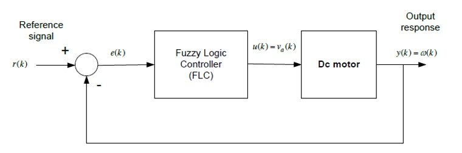

The control signal has to meet the following standards:

- **Disturbance Rejection**: For cyclic frequency ω < 1 rad/sec, the gain of the disturbance must not exceed 20 dB.

- Step response must not exceed 5% elevation

- Zero Position Error

- Rise Time less than 160 msec

- Va(t) < 200V for t >0

  

To implement the controller I have chosen a PI fuzzy controller. Sampling time was set to 0.01 sec. Verbal variables and their membership functions are shown bellow: 

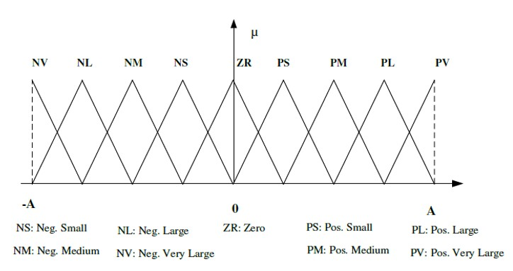

​                                                                                             

Reference signal cannot exceed 150, because ω~max~ = 150 rad/sec. Moreover the range of Δe(k) is [-50,50].

The features of the Fuzzy Controller are:

- Fuzzifier **Singleton**
- Operator AND through min
- Implication Function using **Mamdani** rule
- Operator ALSO through max
- Defuzzifier Center of Sums, **COS**

## Fuzzy Rules Base

Fuzzy Logic Designer, offered by MATLAB, is used to implement the Rules Base.

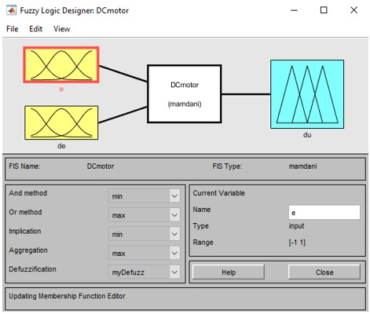

Membership Functions have the following forms:

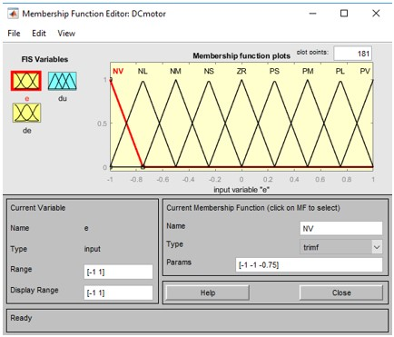

## *Scenario 1*

We investigate the hypothesis of TL = 0.                              

In automatic control systems a PI controller has the form: 

Under those cases, the transfer function of the open loop system is:

The system that was described was solved in order to calculate the values of the unknown variables. I have found that the values **K~p~ = 2** and **K~I~ = 51.077** satisfy our requirements.

At this point we can calculate the values of the parameters:

- 

- 

### Simulink

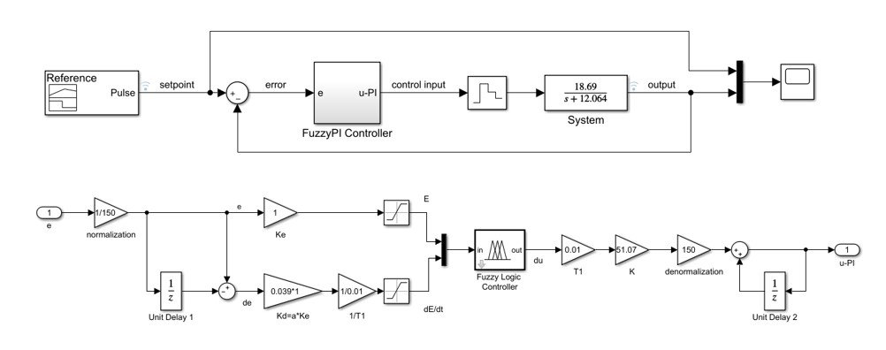

The reference signal was fed using the tool **signal Builder** and the following function:

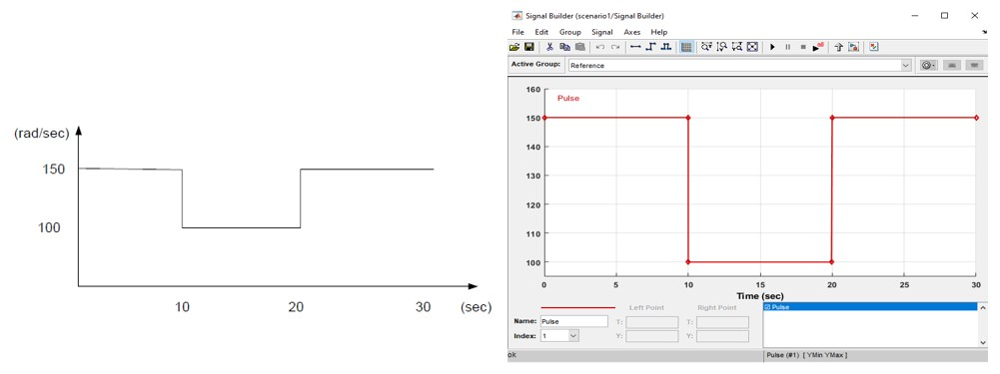

With the help of tool **Data Inspector** we can see that our system meets the requirements:

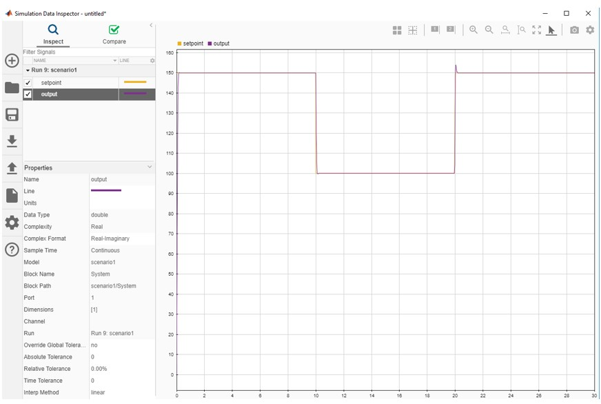

To reduce rise time and steady state error the gains went through the process of **comparative tuning**. The value of **K** and **K~e~** was reduced, while the value of **a** was increased.

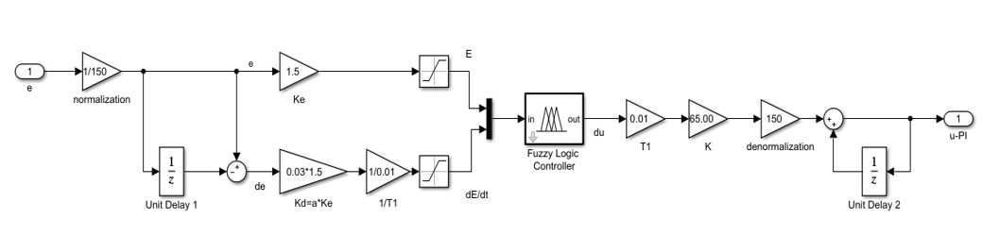

Observing the Data Inspector is clear that rise time and elevation were significantly reduced.

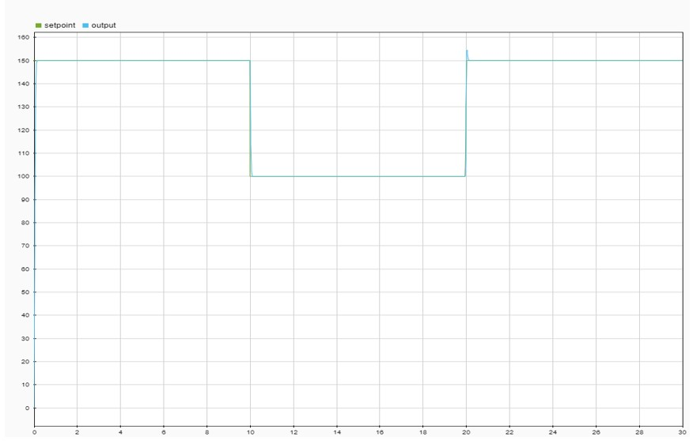

### Rule Viewer

At this point we will examine the output of the system, when input is fed with the rule **IF e is PS AND Δe is NM\. **

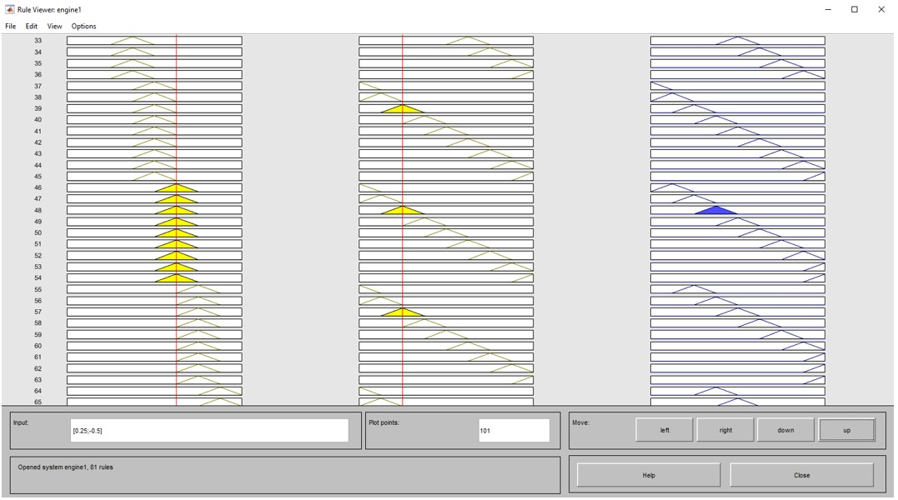

### Surface of output in respect to input

Function **gensurf** was used to produce a graphical relationship between input and output. As output for each fuzzy set is considered its middle point, because of the COS defuzzifier.

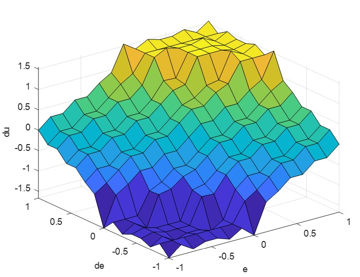

## *Scenario 2*

The signal stands for the speed of a train. For this reason it is essential to ensure the zero elevation of the output signal. The tuning of the gains leads to the following circuit.

### Simulink

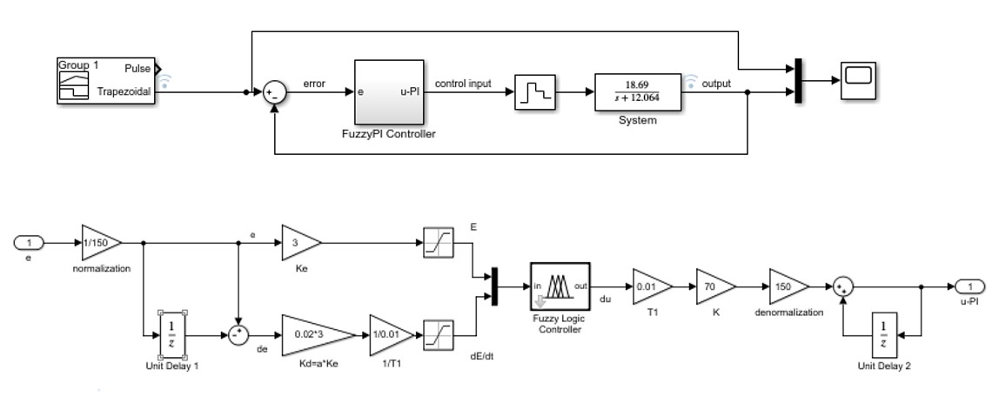

The reference signal has a trapezoidal form, using the signal builder:

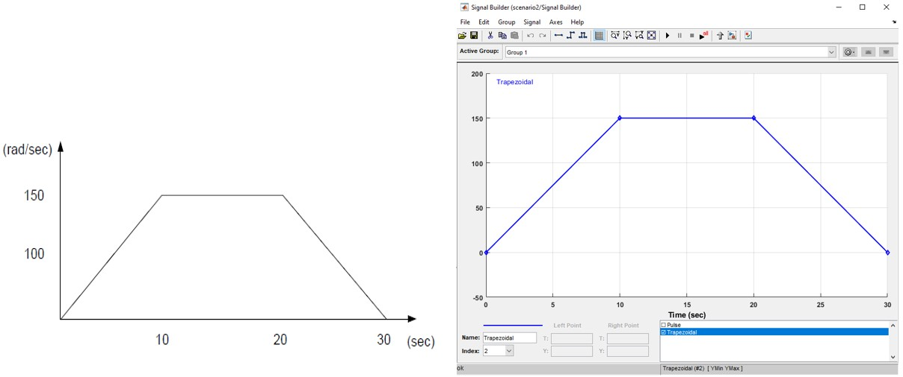

With the help of tool **Data Inspector** we can see that our system meets the requirements:

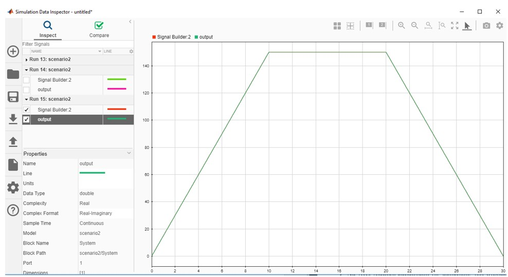

## *Scenario* 3

The hypothesis of this scenario is that we have a non zero T~L~ that stands for a disturbance.

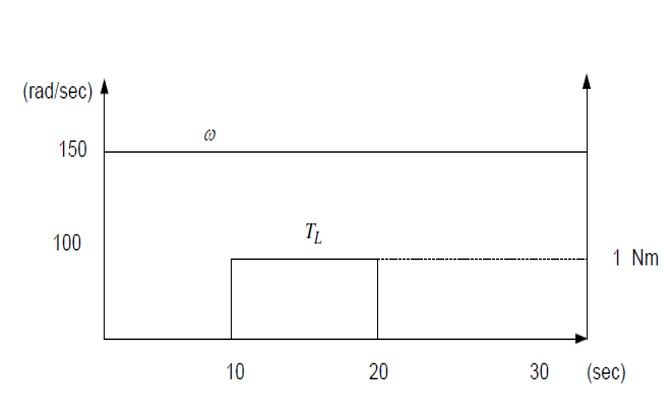

Our controller has to observe this disturbance and reject it. The goal of this scenario is to compare the functionality of a **Fuzzy PI Controller** and a **Conventional PI Controller**.

### Simulink

The two different controllers were embodied to the initial circuit, in order to compare their responses.

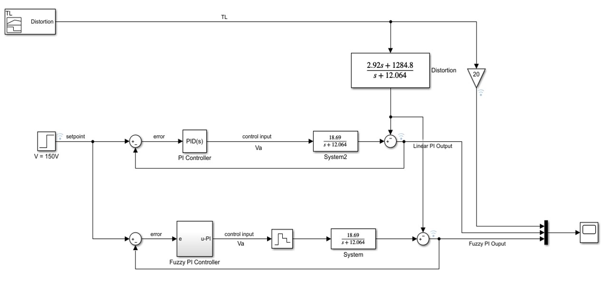

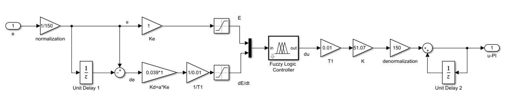

With the help of tool **Data Inspector** we can see the responses:

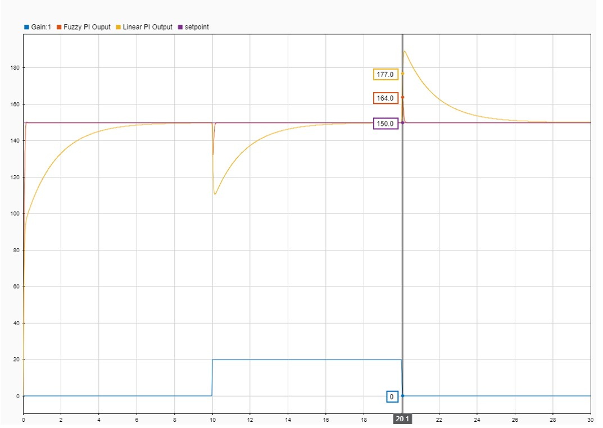

## Conclusion

It is obvious that the **Fuzzy PI Controller** behaves more efficient than the  **Conventional PI Controller**. Not only the rise time is significantly smaller, but also it succeeds a better disturbance rejection. As we can see the gain of the disturbance is: 

