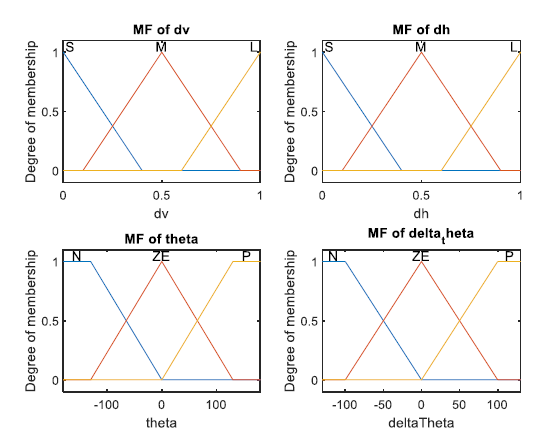

# Group 2

The purpose of this project is the design of a **Fuzzy Logic Controller** for the control of the motion of a virtual 2D car, in order to avoid static obstacles. Sensors measuring vertical and horizontal distance from obstacles are available to achieve this goal. Vehicle's speed is constant and equal to 0.05 m/s. Given the distances and the angle **theta** as inputs the controller has to compute the alteration of the angle **delta theta**.

 The fuzzy sets of the variables are given below:

## Fuzzy Logic Controller

The **Fuzzy Logic Toolbox**, offered by MATLAB, will be used for the implementation of the Fuzzy Logic Controller with the following features: 

- Implementation operator **Larsen**
- Operator AND through **max**
- Composition operator **max-min**
- Defuzzifier Center of Averages, **COA**

Inputs and Outputs have the following **membership functions**:

The next step is the design of the **Fuzzy Rules Base**, which includes sentences with the form:

Rules were designed with respect to Vehicle's distances from obstacles and initial angle theta.

## Route Planning

The membership functions of the inputs and outputs are printed:

The function **distance_sensor** is used to calculate the distances from obstacles. Those distances in combination with initial theta angle are the arguments of a MATLAB built-in **evalfis** function. The output **delta theta** is then added to the previous **theta** value to compute the new angle. The computation of the path continues, until our vehicle cross the boundaries of the map or approach its goal. In the following graphs we can see the results of the computation for different initial theta values:

## Optimized Controller

Although the previous analysis succeeds in approaching the goal position fair enough, we can still optimize our system's behavior. For this reason the fuzziness of the membership functions will be reduced as following:

The route to the goal position is obviously improved:

## Conclusion

By reducing the fuzziness of our fuzzy variables, a better approach of the goal position is succeeded. To do so, the membership functions have to be "crispier".