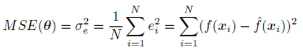
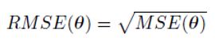
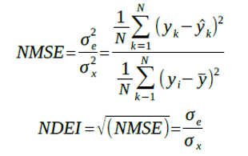
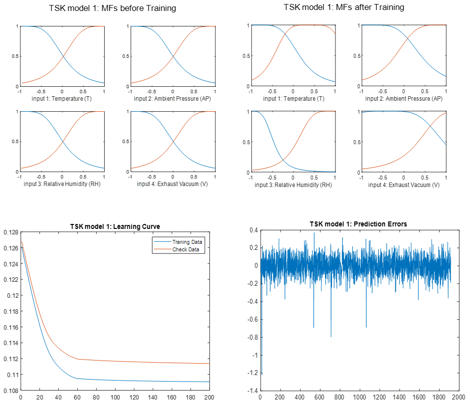
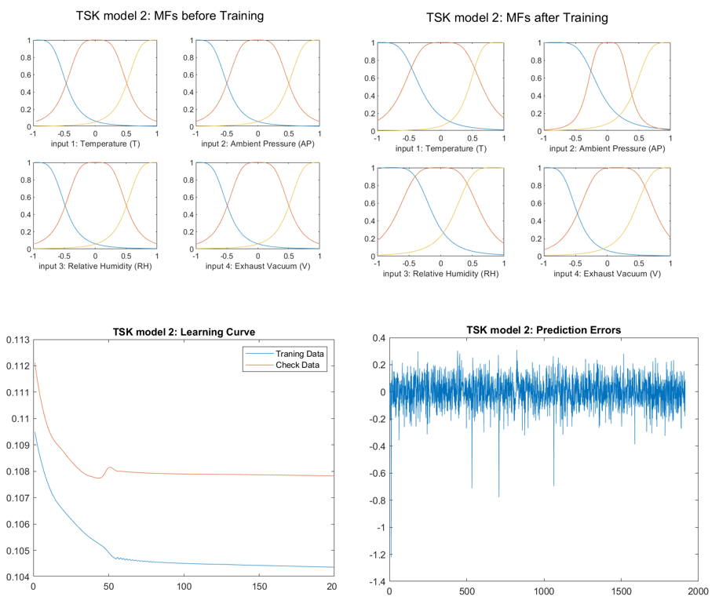
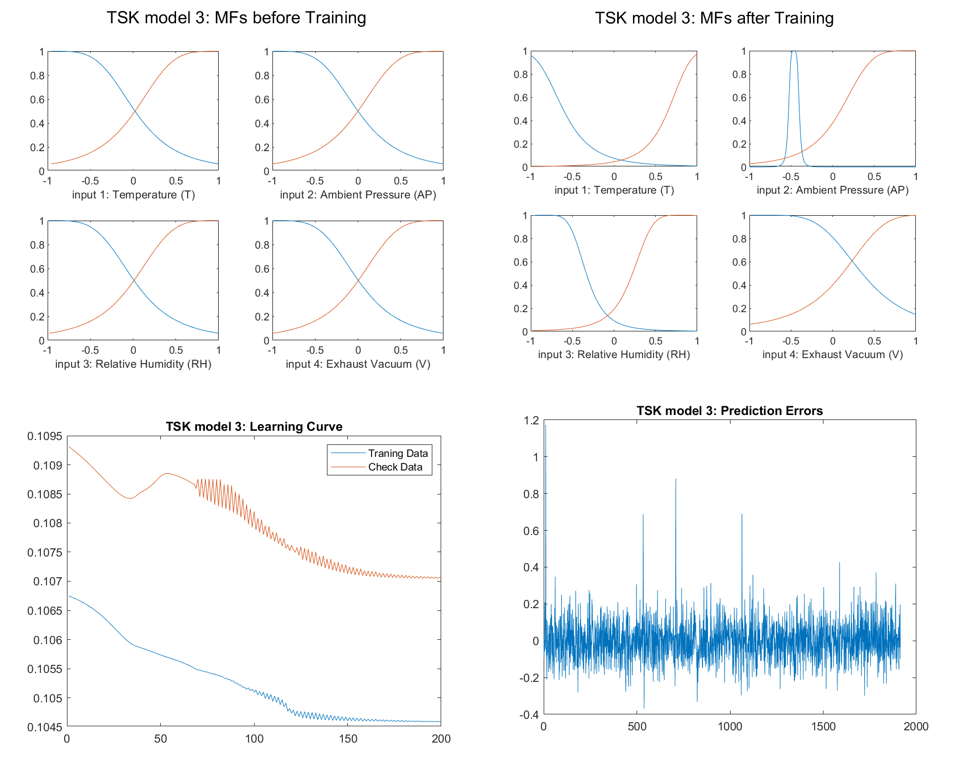
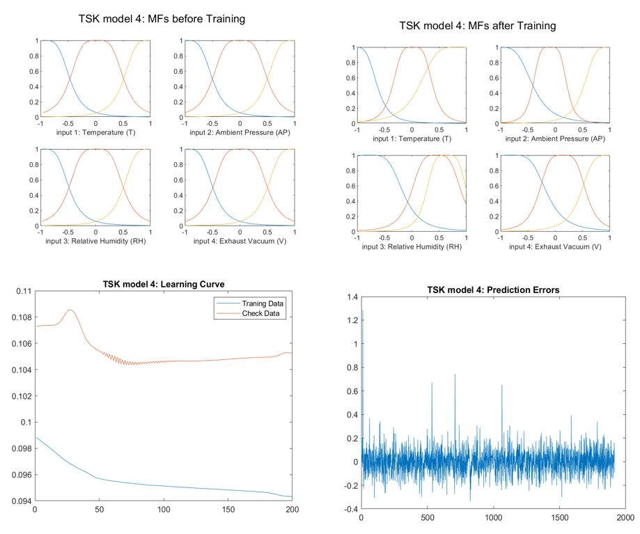

# Group 3

The purpose of this project is to offer a solution to the problem of **Regression**, using **TSK models**. The following project consists of two parts. In the first part we are using a simple dataset to train a neuro-fuzzy system and evaluate its performance. In the second part, a much more complicated dataset will be used. The features will have at first to be **preprocessed** and the model will have to be optimized through a **cross validation** process.

## Simple Dataset

The dataset that will be used for this part is the **Combined Cycle Power Plant (CCPP) dataset** from the UCI repository, which includes 9568 samples of 4 features each. Four scenarios will be examined, that differentiate by the amount of membership functions and output shape.

|                 | MFs  |   Output   |
| --------------- | ---- | :--------: |
| **TSK model 1** | 2    | Singleton  |
| **TSK model 2** | 3    | Singleton  |
| **TSK model 3** | 2    | Polynomial |
| **TSK model 4** | 3    | Polynomial |

The **process** for each model is the following:

- The **dataset** is loaded and the data go through a **normalization** process, in order to belong to [-1,1].
- Loaded data are separated into three not-overlapping groups. **60%** of them are used for **training**, **20%** for **validation** and **20%** for **check**.
- A **fuzzy system** is created by using **genfis** function, using **Grid Partitioning**
- The fuzzy system is trained by using **anfis** function. The number of iterations was set to 200.  The trained model with the minimum error is returned through the variable **chkFIS**, while the train error through the variable **trainError**
- The function **evalfis** is used to evaluate the performance of our model to the validation data. The performance indices are the following metrics:

1. **RMSE**:

2. **R2**

3. **NMSE** and **NDEI**

   

   
   

### TSK model 1

### TSK model 2

### TSK model 3

### TSK model 4

## Conclusion

|                 | **RMSE** | **NMSE** | **NDEI** | R^2      |
| --------------- | -------- | -------- | -------- | -------- |
| **TSK model 1** | 0.114006 | 0.064144 | 0.253267 | 0.935856 |
| **TSK model 2** | 0.110363 | 0.060110 | 0.245173 | 0.939890 |
| **TSK model 3** | 0.111010 | 0.060817 | 0.246611 | 0.939183 |
| **TSK model 4** | 0.106792 | 0.056283 | 0.237240 | 0.943717 |

From the study of the table useful conclusions for the models emerge. The best performance indicators are shown for the 4th model with the three fuzzy sets per input and the polynomial output. It follows the 2nd model with the three membership functions per input and the singleton output. We therefore conclude that the key factor for model quality is the number of input functions per input. More membership functions per input, ie larger partition of the entrance space implies a better model. An important factor, however, is the form of the output. The Polynomial output is preferred by Singleton.

