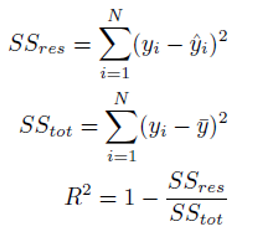
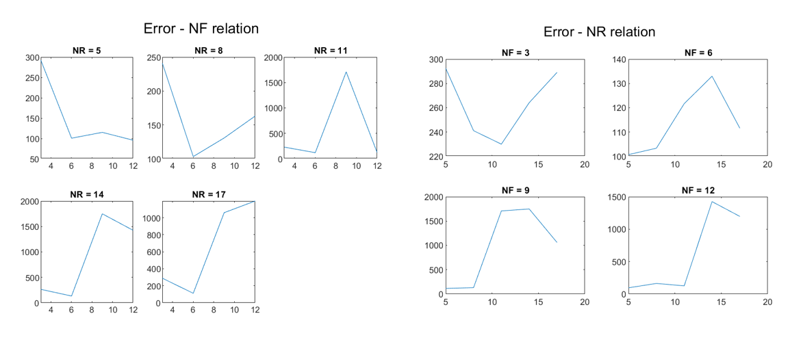

# Group 3

The purpose of this project is to offer a solution to the problem of **Regression**, using **TSK models**. The following project consists of two parts. In the first part we are using a simple dataset to train a neuro-fuzzy system and evaluate its performance. In the second part, a much more complicated dataset will be used. The features will have at first to be **preprocessed** and the model will have to be optimized through a **cross validation** process.

## Simple Dataset

The dataset that will be used for this part is the **Combined Cycle Power Plant (CCPP) dataset** from the UCI repository, which includes 9568 samples of 4 features each. Four scenarios will be examined, that differentiate by the amount of membership functions and output shape.

|                 | MFs  |   Output   |
| --------------- | ---- | :--------: |
| **TSK model 1** | 2    | Singleton  |
| **TSK model 2** | 3    | Singleton  |
| **TSK model 3** | 2    | Polynomial |
| **TSK model 4** | 3    | Polynomial |

The **process** for each model is the following:

- The **dataset** is loaded and the data go through a **normalization** process, in order to belong to [-1,1].
- Loaded data are separated into three not-overlapping groups. **60%** of them are used for **training**, **20%** for **validation** and **20%** for **check**.
- A **fuzzy system** is created by using **genfis** function, using **Grid Partitioning**
- The fuzzy system is trained by using **anfis** function. The number of iterations was set to 200.  The trained model with the minimum error is returned through the variable **chkFIS**, while the train error through the variable **trainError**
- The function **evalfis** is used to evaluate the performance of our model to the validation data. The performance indices are the following metrics:

1. **RMSE**:

2. **R2**

3. **NMSE** and **NDEI**

   

   
   

### TSK model 1

### TSK model 2

### TSK model 3

### TSK model 4

## Conclusion

|                 | **RMSE** | **NMSE** | **NDEI** | R^2      |
| --------------- | -------- | -------- | -------- | -------- |
| **TSK model 1** | 0.114006 | 0.064144 | 0.253267 | 0.935856 |
| **TSK model 2** | 0.110363 | 0.060110 | 0.245173 | 0.939890 |
| **TSK model 3** | 0.111010 | 0.060817 | 0.246611 | 0.939183 |
| **TSK model 4** | 0.106792 | 0.056283 | 0.237240 | 0.943717 |

From the study of the table useful conclusions for the models emerge. The best performance indicators are shown for the 4th model with the three fuzzy sets per input and the polynomial output. It follows the 2nd model with the three membership functions per input and the singleton output. We therefore conclude that the key factor for model quality is the number of input functions per input. More membership functions per input, ie larger partition of the entrance space implies a better model. An important factor, however, is the form of the output. The Polynomial output is preferred by Singleton.

## High Dimension Dataset

The dataset that will be used for this part is the **Superconductivity dataset** from the UCI repository, which includes 21263 samples of 81 features each. Obviously such a dimensionality in combination with Grid Partitioning is extremely computational expensive and should not be preferred. For this reason, a reduction in the number of features, as well as in the number of the rules will be attempted. The most important features will be selected with the help of **Relief** algorithm, while the input space will be separated through **Subtractive Clustering**. To find the optimal parameters, a grid search will be used under the following sets: **NF = [3 6 9 12]**  and  **NR = [5 8 11 14 17]** (NF stands for number of Features and NR for number of Rules). A **5-fold Cross Validation** process is implemented for each 2D point of the grid and the average error is saved. When the optimal pair is found, it will be used to train the final model.

### Grid Search

- The **dataset** is loaded and the data go through a **normalization** process, in order to belong to [-1,1].
- Loaded data are separated into three not-overlapping groups. **60%** of them are used for **training**, **20%** for **validation** and **20%** for **check**.
- The most important features are extracted with **Relief** algorithm and a table of indices of features with descending significance is returned. The parameter of the nearest neighbors k remains as default (10).
- Create a grid for error and rules, where each row represents the number of attributes and each column the number of rules. These values are obtained from the sets NF = [3 6 9 12] and NR = [5 8 11 14 17]. Also initialization of 4x5 radii matrix. **Radii** indicates the amplitude of the participation functions of the input variables which in our case is Gaussian. So a small radii means a small variation around an average value, while a large radii means a large variation. The values it takes are in the interval [0,1] and were chosen appropriately so that **genfis2** gives the desired number of rules.
- A model with **genfis2** is generated for each point of the grid. At each point of the grid the training set has kept only the most important features. As arguments in the function are these characteristics and the corresponding radii.

| radii |       |       |       |       |       |
| :---: | :---: | :---: | :---: | :---: | :---: |
|       | 0.505 | 0.295 | 0.265 | 0.190 | 0.141 |
|       | 0.480 | 0.340 | 0.230 | 0.190 | 0.120 |
|       | 0.522 | 0.395 | 0.233 | 0.193 | 0.157 |
|       | 0.605 | 0.390 | 0.315 | 0.198 | 0.185 |

- 5-Fold Cross Validation application for each point of the grid. The training set is divided into 5 sections. 4 of them are used for the training of one model at a time and the last one for its validation. Five different combinations give birth to 5 different models for each point of the grid. Each of these models is trained with **anfis** with different training and verification sets from the rest 4. All models have as their initial **fis** what was born in the previous step. A small number of iterations are used (40 due to increased computational complexity.
- Models estimate outputs with inputs to the initial validation sets via the **evalfis** function. The corresponding position of the error grid is filled with Mean-Squared Error.
- Finally, the point of the grid that gives the minimum **MSE** is calculated. This is the optimal combination of parameters. This is for number of features **NF = 12** and number of rules **NR = 5** with **radii = 0.605**. The error curves for the number of attributes and the number of rules are shown below:

### Final TSK model

The values found by the previous method (NF = 12 and NR = 5 with radii = 0.605) are taken as appropriate to create the final model. The procedure followed is the following:

- Dataset The dataset is loaded and shuffled. Then there is normalization with the known method.

- Data is divided into training, validation and check.

- The idx table of features importance is loaded and the most important ones are selected based on the NF parameter.

- A model is created using **genfis2** and arguments the training set and the optimal radii.

- The 4 most important inputs before the training are displayed in more detail.

  

- Training with anfis with a number of seasons of 200 and chkFIS is obtained with the smallest validation error.

- Evalfis is used with input of the most important features of the check set and chkFIS.

- The **performance indicators** are calculated and a table is created. Finally, the 4 most important inputs after the training are displayed, as well as the Learning Curve and the values predicted by the model with the actual values.

  

|                     | **RMSE** | **NMSE** | **NDEI** | R^2      |
| ------------------- | -------- | -------- | -------- | -------- |
| **Final TSK Model** | 0.176894 | 0.229094 | 0.478638 | 0.770906 |

## Conclusion

In summary, from the 81 features using the Relief algorithm, we managed to reduce the number of features to 12 and get satisfactory results. In addition the number of rules of the fuzzy system is selected as 5 with the help of Subtractive Clustering, a number much more manageable than the number of rules that would be produced with Grid Partitioning. In this case, if we had again selected 12 characteristics with two fuzzy sets per attribute, 2 ^ 12 = 4096 rules would have been formed, while if we had three fuzzy sets per attribute, 3 ^ 12 = 531441 rules would have been formed. It is obvious that a model with so many rules is computationally impossible to produce.