# Group 4

The purpose of this project is to offer a solution to the problem of **Classification**, using **TSK models**. The following project consists of two parts. In the first part we are using a simple dataset to train a neuro-fuzzy system and evaluate its performance. In the second part, a much more complicated dataset will be used. The features will have at first to be **preprocessed** and the model will have to be optimized through a **cross validation** process.

## Simple Dataset

The dataset that will be used for this part is the **avila dataset** from the UCI repository, which includes 20876 samples of 10 features each. Five scenarios will be examined, that differentiate by the amount of **IF-THEN** rules. The aim is to study the effect of input space partitioning - depending on the complexity it entails, on the classifier performance. The partition of the entrance space will be done with the method of Subtractive Clustering using genfis2 and the resulting TSK models will differ in the parameter that determines the number of rules. Models with rules from the set **NR = [4 8 12 16 19]** will be created.

The **process** for each model is the following:

- Initially the dataset is loaded and the data is **preprocessed**. The first step is to use the **unique** function to delete the duplicate records of the dataset. It is observed that this dataset has 12 different classes.

- To ensure the homogeneity of the data these are mixed. For this purpose a random procedure is used which involves the use of the **randperm** function in the indexes of the records. To ensure that the same shuffle is performed in each execution of the program, **rng (0)** is used, which initializes the initial conditions of the rand function to the same number each time.

- The data is **normalized** with the now known procedure. The minimum of each column is subtracted from each element and the result is divided by the maximum-minimum difference. Then the result is multiplied by two and 1 is subtracted.

- The data is then divided into three **non-overlapping sections**, the first of which will be used for training, the second for validation and avoidance of the overtraining effect and the last for checking the performance of our final model. The separation that applies is the first 60% for training, the next 20% for validation and the last 60% of entries for checking. Emphasis is placed on the fact that the frequency of samples of each class must be the same in all three sets. This is ensured through a process, in which the data is divided into cells based on their class. Then the corresponding part of the cells is added to each set using **vertcat**.

- For each of the five models the **genfis2** function is called, with the following arguments:

  1. The training set divided into characteristics and classes
  2. The radii appropriately initialized to produce the rules
  3. The xBounds table that contains the maximum and minimum elements of each column
  4. An opt structure that includes the following fields:

  - SquashFactor: multiplier for radii (selected as 0.5)
  - AcceptRatio: a potential threshold above which a point is considered a cluster center (selected as 0.61)
  - RejectRatio: a potential threshold below which a point is discarded as the cluster center (selected as 0.055)
  - Vebose: a boolean variable for displaying clustering information

  After a trial and error procedure the radii values that meet the rule number specification were found to be [0.90 0.41 0.31 0.26 0.22].
  Then manually change the output function type to constant.

- The created model is now ready to be trained. The anfis function will be used for this purpose, which will take as training the data of the training and an opt structure, similar to the previous one. The new structure will be born with the anfisOptions command. The fields of the structure include the initial fis, the number of repetitions (200 experimental) of the training process and the validation set. The function returns a trained fis, the training error in each trainError iteration, the training step, the trained chkFIS model with the smallest validation data error, and the validation data error for each iteration.

- The evalfis function is then applied to the model with the smallest error in the validation data according to the previous procedure (chkFIS) and by entering the first 10 columns of the control set. This function predicts an output value for each of the set entries, which is rounded to the nearest integer number.

- Finally, the Confusion Matrix of the following image is created and the performance indicators that will be defined below are applied to the output value:

  

 
    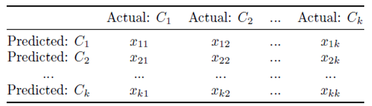 

​	1.**Overall Accuracy**: The total accuracy of a classifier is defined as the percentage of correctly classified   	samples relative to the total number of samples.

 
    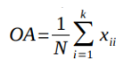 

2. **Producer’s accuracy – User’s accuracy**:

   
 
       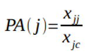 
   

   
 
       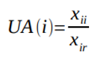 
   

   
 
       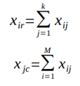 
   

   

   3. 
 
          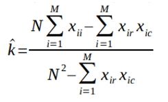 
      

Next, for the five models, the final forms of the resulting vague sets and learning curves will be presented, as well as a table containing the performance indicators described for each model.

### TSK model 1

 
    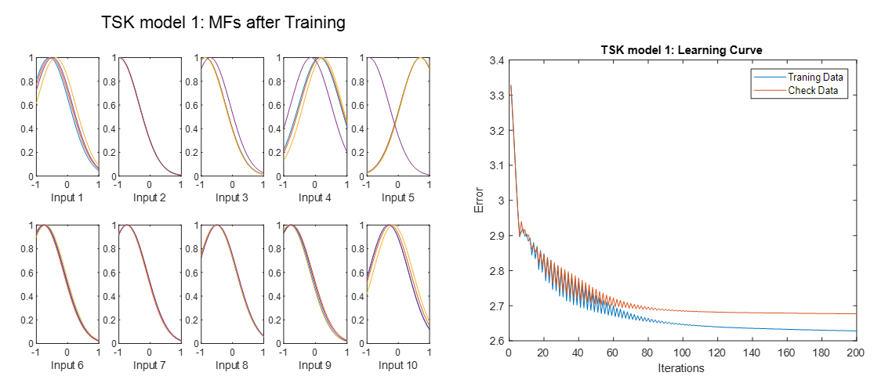 

### TSK model 2

 
    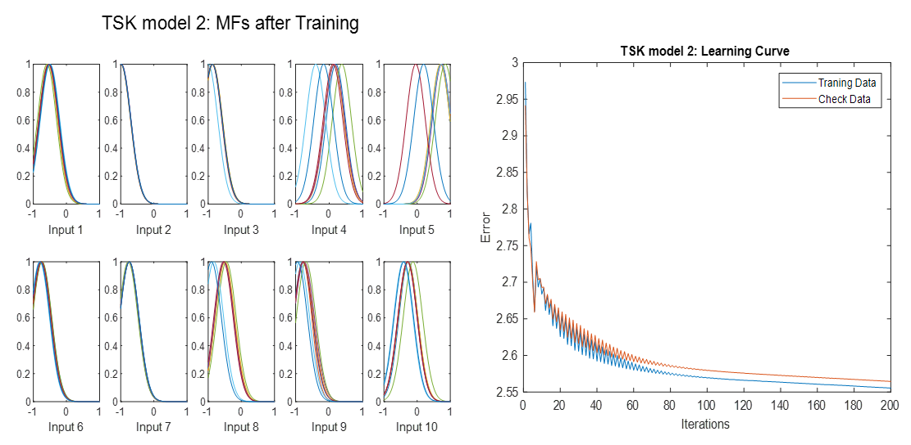 

### TSK model 3

 
    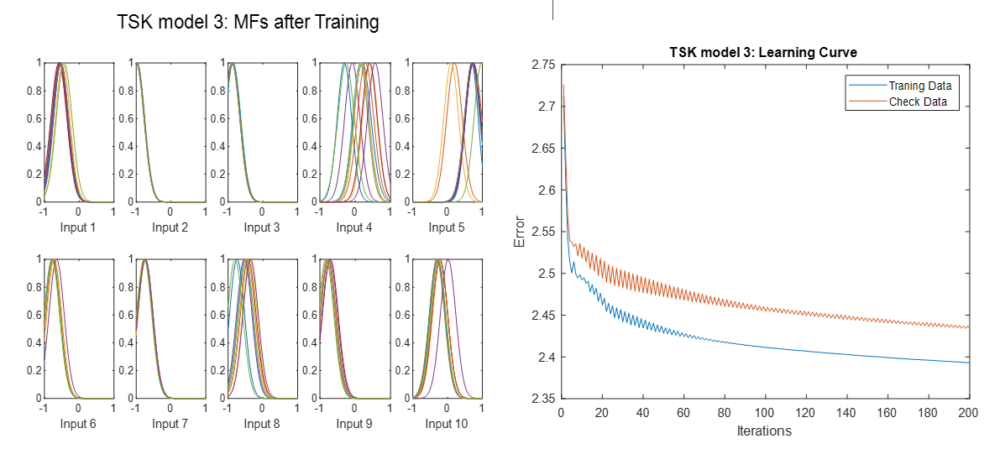 

### TSK model 4

 
    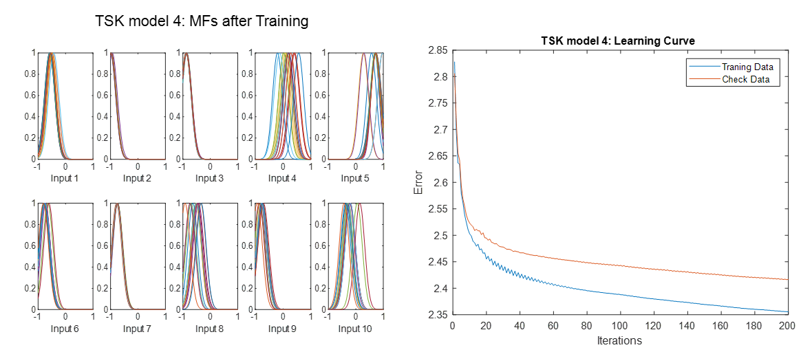 

### TSK model 5

 
    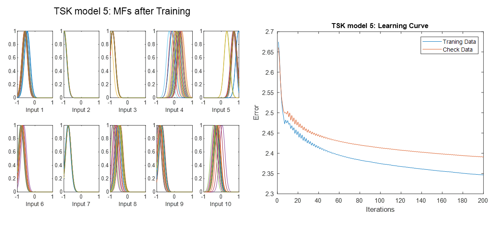 

## Conclusion

|                 | **Average Accuracy** | **Average PA | **Average UA** | **Average k** |
| --------------- | -------------------- | ------------ | -------------- | ------------- |
| **TSK model 1** | 7.0419               | 5.5164       | 0.2285         | 6.9142        |
| **TSK model 2** | 8.7425               | 6.3887       | 1.0318         | 8.7300        |
| **TSK model 3** | 8.6707               | 7.5126       | 0.5786         | 8.5539        |
| **TSK model 4** | 11.6407              | 7.5292       | 0.5008         | 11.3426       |
| **TSK model 5** | 13.1737              | 7.7108       | 1.0483         | 13.1647       |

 
    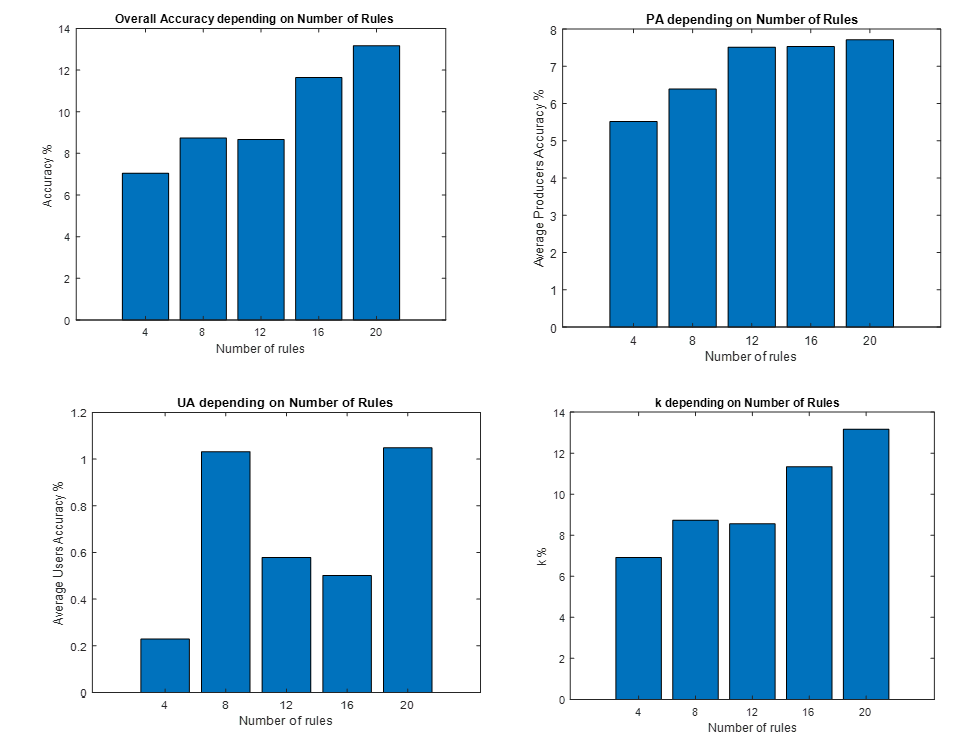 

It becomes obvious that as the rules increase, the performance of the model improves. In addition to the diagrams of the participation functions we see that the more the rules increase the more the fuzzy variables of inputs overlap with each other. We therefore conclude that the more overlap there is between the fuzzy sets, the more rules are activated and the more effective the model becomes.

## High Dimension Dataset

The dataset that will be used for this part is the **Isolet dataset** from the UCI repository, which includes 7797 samples of 618 features each. Obviously such a dimensionality in combination with Grid Partitioning is extremely computational expensive and should not be preferred. For this reason, a reduction in the number of features, as well as in the number of the rules will be attempted. The most important features will be selected with the help of **Relief** algorithm, while the input space will be separated through **Subtractive Clustering**. To find the optimal parameters, a grid search will be used under the following sets: **NF = [3 8 13 18]**  and  **NR = [6 8 10 13 15]** (NF stands for number of Features and NR for number of Rules). A **5-fold Cross Validation** process is implemented for each 2D point of the grid and the average error is saved. When the optimal pair is found, it will be used to train the final model.

### Grid Search

- The **dataset** is loaded and the first step is to delete the duplicate records with the **unique** function. Then data go through a **normalization** process, in order to belong to [-1,1].
- Loaded data are separated into three not-overlapping groups. **60%** of them are used for **training**, **20%** for **validation** and **20%** for **check**, in a way that ensures the homogeneity of the classes in them, as described in the previous part of the work.
- The most important features are extracted with **Relief** algorithm and a table of indices of features with descending significance is returned. The parameter of the nearest neighbors k remains as default (10).
- Create a grid for error and rules, where each row represents the number of attributes and each column the number of rules. These values are obtained from the sets **NF = [3 8 13 18\]** and **NR = [6 8 10 13 15].**  Also initialization of 4x5 radii matrix. **Radii** indicates the amplitude of the participation functions of the input variables which in our case is Gaussian. So a small radii means a small variation around an average value, while a large radii means a large variation. The values it takes are in the interval [0,1] and were chosen appropriately so that **genfis2** gives the desired number of rules.
- 

| radii |       |       |       |       |       |
| :---: | :---: | :---: | :---: | :---: | :---: |
|       | 0.550 | 0.430 | 0.320 | 0.246 | 0.220 |
|       | 0.850 | 0.560 | 0.475 | 0.280 | 0.262 |
|       | 0.680 | 0.550 | 0.480 | 0.380 | 0.330 |
|       | 0.920 | 0.680 | 0.520 | 0.415 | 0.350 |

- A model with **genfis2** is generated for each point of the grid. At each point of the grid the training set has kept only the most important features. As arguments in the function are these characteristics and the corresponding radii. For the opt table I came up with **opt = [0.75 0.70 0.125 0]**. Then the output is changed manually to constant.

- **5-Fold Cross Validation** application for each point of the grid. The training set is divided into 5 sections. 4 of them are used for the training of one model at a time and the last one for its validation. Five different combinations give birth to 5 different models for each point of the grid. Each of these models is trained with **anfis** with different training and verification sets from the rest 4. All models have as their initial **fis** what was born in the previous step. A small number of iterations are used (50 due to increased computational complexity.
- The model estimate the output, using as input the initial validation set to the **chkFIS** system resulting from the previous step, ie the model with the least error. The Confusion Matrix is formed and the Accuracy is measured. In the appropriate position of the error grid is placed the average of the errors, ie 1 minus the accuracy.
- Finally, the point of the grid that gives the minimum error is calculated. This is the optimal combination of parameters. This is for number of features **NF = 18** and number of rules **NR = 13** with **radii = 0.415**. The error curves for the number of attributes and the number of rules are shown below:

 
    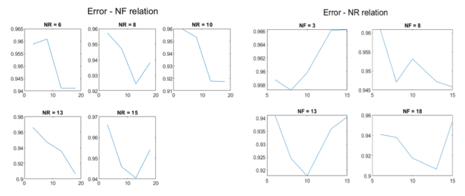 

### Final TSK model

The values found by the previous method (**NF = 18 and NR = 13 with radii = 0.415**) are taken as appropriate to create the final model. The procedure followed is the following:

- Dataset is loaded and the duplicates are removed. Then there is normalization with the known method.

- The data are divided into training, validation and control, taking care to maintain the occurrence frequencies of the classes in the three sets.

- The idx table of attribute importance is loaded and the most important ones are selected based on the NF parameter.

- A model is created using **genfis2** and arguments the training set, the optimal radii, the table with the minimums and maxima of each feature and the opt structure used in the grid search and the output is changed manually.

- All and especially the 4 most important entrances before the training are displayed in more detail.

  

 
    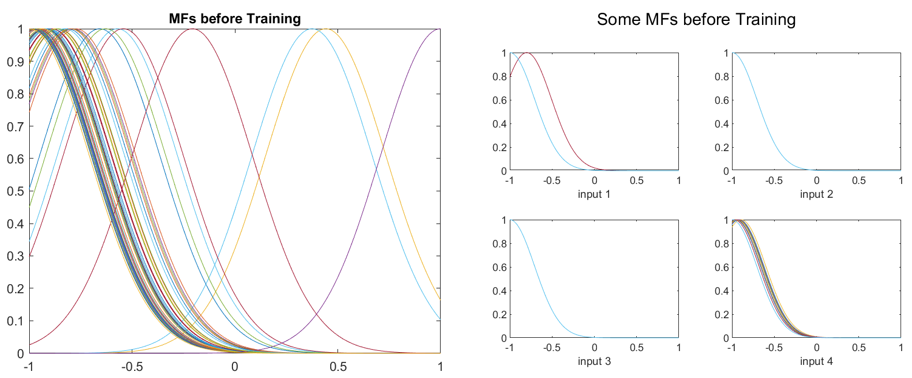 

- Training with anfis with a number of seasons of 400 and chkFIS is obtained with the smallest validation error.

- Evalfis is used with input of the most important features of the control set and chkFIS. The result is rounded to the nearest whole number.

- The **performance indicators** are calculated and a table is created. Finally, the 4 most important inputs after the training are displayed, as well as the Learning Curve and the values predicted by the model with the actual values.

 
    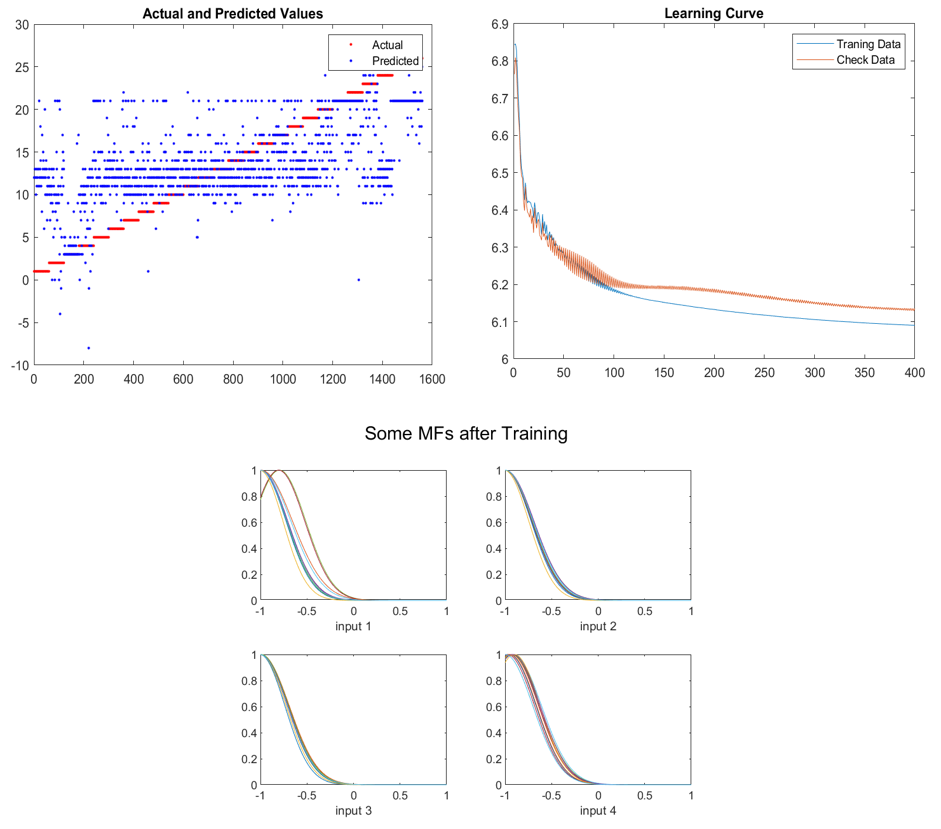 

|                     | **Overall Acc.** | **Producer’s** Acc. | **User’s   Acc**. |  **k**   |
| ------------------- | :--------------: | :-----------------: | :---------------: | :------: |
| **Final TSK Model** |     0.108333     |      0.090789       |     0.108333      | 0.108091 |

## Conclusion

In summary, from the 618 features using the Relief algorithm, we managed to reduce the number of features to 18 and get satisfactory results. In addition, the number of rules in the fuzzy system is selected as 13 with the help of Substractive Clustering, a number much more manageable than the number of rules that would be generated by Grid Partitioning. In this case, if we had again selected 18 characteristics with two fuzzy sets per attribute, 2 ^ 18 = 262144 rules would be formed, while if we had three fuzzy sets per attribute, 3 ^ 18 = 387420489 rules would be formed. It is obvious that a model with so many rules is computationally impossible to produce. In addition we can say that the more the fuzzy sets overlap the more rules are activated and the more the accuracy of the model increases. After training the overlaps increase.